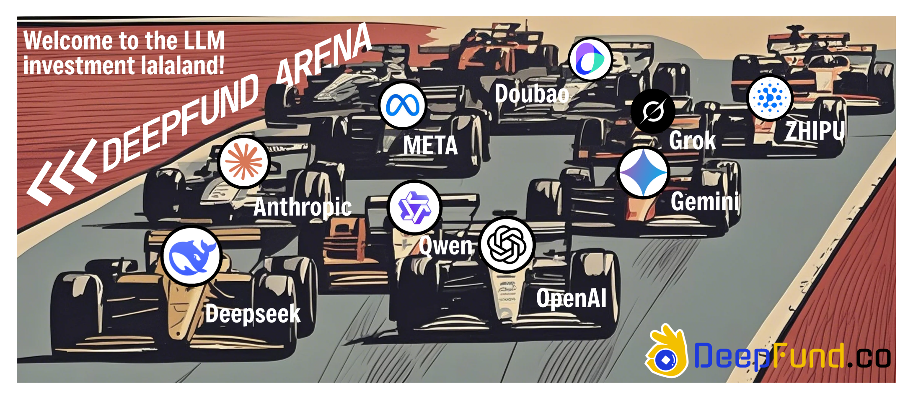
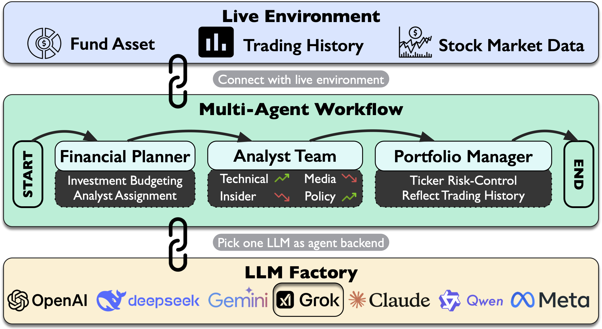

# 💰💰  DeepFund 🔥🔥

[](https://arxiv.org/abs/2503.18313)
[](https://www.python.org/downloads/release/python-3110/)
[](https://deepfund.paradoox.ai/)
[](https://deepwiki.com/HKUSTDial/DeepFund)

## Will LLMs Be Professional At Fund Investment? 
This project serves as an ideal solution to the above key question. We evaluate the trading capability of LLM across various financial markets given a unified environment. The LLM shall ingest external information, drive a multi-agent system, and make trading decisions. The LLM performance will be presented in a trading arena view across various dimensions. 



> 🏁 Car-racing is for illustration only. LLM performance is subject to the real market. <br>
> ‼️ This project is for research purposes only, it **DOES NOT TRADE**.


## Updates
- 2025-06-09: DeepFund Trading Arena is available at [this link](https://deepfund.paradoox.ai/)
- 2025-05-24: Our project paper is released on [arXiv](https://arxiv.org/abs/2503.18313)


## Contact Us
This project aims to be a **long-term research project**. We are adding more particular analysts, expanding market coverage and building dashboard to deliver fresh insights.
- General Inquiries: Mr. Changlun Li, cli942[at]connect.hkust-gz.edu.cn
- Research Collaboration: Prof. Yuyu Luo,  yuyuluo[at]hkust-gz.edu.cn


## Framework



## Setup Environment

1. Choose an environment manager:
   - If you want to use **Anaconda**: Install Conda (if not already installed): Go to [anaconda.com/download](https://www.anaconda.com/download/).
   - If you want to use **uv**: Install uv (if not already installed): Go to [uv installation guide](https://docs.astral.sh/uv/getting-started/installation).

2. Clone the repository:
```bash
git clone https://github.com/HKUSTDial/DeepFund.git
cd DeepFund
```

3. Create a virtual env from the env configuration file:
    - If you are using **Anaconda**:
         ```bash
         conda env create -f environment.yml # if using Conda
         ```
    - If you are using **uv**:
         ```bash
         uv sync # detects pyproject.toml, create an venv at project root, and install the dependencies
         source .venv/bin/activate # or .venv\Scripts\activate for windows to activate the venv
         ```

4. Set up environment variables:
```bash
# Create .env file for your API keys (OpenAI, DeepSeek, etc.)
cp .env.example .env
```

## Connect to Database
To better track the system performance, DeepFund uses a database to timely monitor the trading status. Besides, it also stores the LLM reasoning results for future analysis and traceback.

### Option 1: Use **Supabase**
DeepFund connects to Supabase **by default**. 
- Supabase is a PostgreSQL-compatible Cloud Database
- You can create a free account on [Supabase](https://supabase.com/) website.
- Refer to `src/database/supabase_setup.sql` to create the tables.
- Update the `SUPABASE_URL` and `SUPABASE_KEY` in `.env` file.

### Option 2: Use **SQLite**
SQLite is a lightweight database that stores data locally.
- Run the following command to **create a sqlite database** in the path
```bash
cd src
python database/sqlite_setup.py
```
- You may need to install VSCode Extension [SQLite Viewer](https://marketplace.cursorapi.com/items?itemName=qwtel.sqlite-viewer) to explore the database.
- Path: `src/assets/deepfund.db`


### Relation Diagram
DeepFund system gets supported by four elementary tables: 
- Config: store user-defined configurations
- Portfolio: record the portfolio updates
- Decision: record the trading decisions from managers
- Signal: record the signals generated from analysts

The ERD is generated by Supabase - DB Schema Visualizer.

<p align="center">
  
  <br>
</p>


## Running the System
Enter the `src` directory and run the `main.py` file with configuration:
```bash
cd src
python main.py --config xxx.yaml --trading-date YYYY-MM-DD [--local-db]
```

`trading-date` coordinates the trading date for the system. It can be set to historical trading date till the last trading date. As the portfolio is updated daily, client must use it in **chronological order** to replay the trading history.
Switch to local DB by adding `--local-db` option in the command line. 

### Configurations
Configs are saved in `src/config`. Below is a config template:
```yaml
# Deep Fund Configuration
exp_name: "my_unique_exp_name"

# Trading settings
tickers:
  - ticker_a
  - ticker_b

# Analysts to run, refer to graph.constants.py
planner_mode: true/false
workflow_analysts:
  - analyst_a
  - analyst_b
  - analyst_c

# LLM model settings, refer to llm/inference.py
llm:
  provider: "provider_name" 
  model: "model_name"
```


### Planner Mode
We use `planner_mode` configs to switch the mode:
- **True**: Planner agent orchestrates which analysts to run from `workflow_analysts`.
- **False**: All workflow analysts are running in parallel without orchestration.

### Remarks
- `exp_name` is **unique identifier** for each experiment. You shall use another one for different experiments when configs are changed.
- Specify `--local-db` flag to use SQLite. Otherwise, DeepFund connects to Supabase by default.


## Project Structure 
```
deepfund/
├── src/
│   ├── main.py                   # Main entry point
│   ├── agents/                   # Agent build and registry
│   ├── apis/                     # APIs for external financial data
│   ├── config/                   # Configuration files
│   ├── database/                 # Database setup and helper
│   ├── example/                  # Expected output
│   ├── graph/                    # Workflow, prompt, and schema
│   ├── llm/                      # LLM providers
│   ├── util/                     # Utility functions and helpers
├── environment.yml               # For Conda
├── README.md                     # Project documentation
├── ...
```

## 📚 Additional Resources

**[Technical Guide](./TECHNICAL_GUIDE.md)** - Detailed information for developers including:
  - Analyst breakdown and system architecture
  - System dependencies and API requirements  
  - Advanced usage: Adding new analysts and LLM providers

## Acknowledgements
The project gets inspiration and supports from the following projects:
- [AI Hedge Fund](https://github.com/virattt/ai-hedge-fund), An AI Hedge Fund Team
- [LangGraph](https://langchain-ai.github.io/langgraph/tutorials/workflows), Tutorial on Workflows and Agents
- [OpenManus](https://github.com/mannaandpoem/OpenManus), An open-source framework for building general AI agents
- [Supabase](https://supabase.com/), The Open Source Firebase Alternative
- [Cursor AI](https://www.cursor.com/), The AI Code Editor


## Citation
If you find it useful, please cite it as follows:

- Project Paper
```bibtex
@misc{li2025timetravel,
      title={Time Travel is Cheating: Going Live with DeepFund for Real-Time Fund Investment Benchmarking}, 
      author={Changlun Li and Yao Shi and Chen Wang and Qiqi Duan and Runke Ruan and Weijie Huang and Haonan Long and Lijun Huang and Yuyu Luo and Nan Tang},
      year={2025},
      eprint={2505.11065},
      archivePrefix={arXiv},
      primaryClass={cs.CE},
      url={https://arxiv.org/abs/2505.11065}, 
}
```

- Vision Paper
```bibtex
@misc{li2025deepfund,
      title={DeepFund: Will LLM be Professional at Fund Investment? A Live Arena Perspective}, 
      author={Changlun Li and Yao Shi and Yuyu Luo and Nan Tang},
      year={2025},
      eprint={2503.18313},
      archivePrefix={arXiv},
      primaryClass={cs.MA},
      url={https://arxiv.org/abs/2503.18313}, 
}
```
